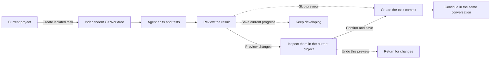

# dsh-git-worktree

[](https://www.npmjs.com/package/dsh-git-worktree)
[](https://www.npmjs.com/package/dsh-git-worktree)
[](https://github.com/wloops/dsh-git-worktree/actions/workflows/ci.yml)
[](LICENSE)

**Let agents complete tasks in independent Git Worktrees, then review the changes before deciding whether to save them.**

`dsh-git-worktree` is a Git Worktree plugin for [DeepSeek Harness](https://github.com/deepseek-ai/DeepSeek-Harness). It creates a separate Worktree (working directory) for every coding task, so the agent does not directly edit the project you are using. When the task is complete, you can preview the result and then save it, send it back for changes, or discard it.

This Git Worktree workflow originated in [Domi](https://github.com/restflux/domi), an open-source desktop coding workbench powered by the Pi Agent Runtime. This plugin is independently adapted for DeepSeek Harness and can be installed and used on its own.

[中文](README.md) · [Full usage guide](docs/USAGE.en.md) · [Architecture](docs/WORKTREE-CONSOLE-ARCHITECTURE.md)

## Why use it?

When an agent edits the current project directly, its changes can mix with your unfinished work. Running multiple tasks at once can also make them interfere with one another. With this plugin:

- every task is edited and tested in its own Git Worktree (an independent working directory);
- multiple tasks can run at the same time without sharing one working directory;
- when the agent finishes, you can temporarily show the changes in the current project and inspect them;
- changes are saved only after confirmation, and conflicts never overwrite your work automatically.

## Highlights

- **Git Worktree isolation**: every task gets its own working directory and its own agent conversation.
- **Run multiple Worktrees**: develop several tasks in parallel; to avoid mixing changes, review one task at a time per project.
- **Preview before committing**: inspect the real result in the current project without immediately creating a Git commit.
- **Send it back safely**: undo the current preview and ask the agent for more changes without disturbing unrelated local work.
- **Save only this task**: confirmation commits only the current task instead of pulling unrelated changes into it.
- **Preserve progress on long tasks**: save the current stage and keep developing; the stages still become one final delivery.
- **Protect the working state**: branch changes, conflicts, and interrupted operations stop safely and leave the state available for recovery.
- **See related tasks together**: tasks from the same project are grouped in the sidebar for status checks and navigation.
- **Continue in the same conversation**: after delivery, begin another task without opening a new conversation.

> The current version manages Git Worktrees within one project. It does not yet provide a global cross-project manager.

## Workflow



### Which action should I choose?

| Goal | Action |
| --- | --- |
| Inspect the result in the current project | **Preview changes** |
| The preview looks correct | **Confirm and save** |
| Preserve progress during a long task | **Save checkpoint and continue** |
| Ask the agent for more edits | **Continue editing** or **Undo this preview** |
| Save without inspecting it first | **Skip preview and save** |

See the [full usage guide](docs/USAGE.en.md) for detailed actions, recovery scenarios, and commands.

## Quick start

### Requirements

- Node.js `^22.19.0 || >=24.0.0`
- DeepSeek Harness `0.1.2-rc.1` package line
- Harness Web Client
- A Git Workspace

Before upgrading an existing Harness installation, handle Host data migration: `0.1.2-rc.1` removes the optional SQLite Session backend, so use an older Harness version to export that data first. Code Mode is now named PTC mode, while existing conversation records remain readable. Launch applications and install this plugin through a `dsh` Profile.

After upgrading Harness from an earlier release, the web UI may show **Failed to load plugins** with an error mentioning `@deepseek-ai/dsh-client-runtime/client` missed the module table. This means the installed plugin is still a `0.7.2`-or-older build; older releases depend on the discontinued `dsh-client-runtime`. Reinstall version `0.7.3` or later and restart Harness:

```bash
dsh plugin --profile web add dsh-git-worktree@0.7.3
```

### Install

```bash
dsh plugin --profile web add dsh-git-worktree
```

Or install a specific version:

```bash
dsh plugin --profile web add github:wloops/dsh-git-worktree#v0.7.3
```

Open a Git Workspace and enable **Worktree** when creating a Session. An existing Local Session can also let the model call `worktree_create`.

For the first run, complete one full create → Preview changes → Confirm and save → cleanup cycle.

If pnpm build approval blocks a Git-source install, or you need complete commands and troubleshooting, see [Installation and troubleshooting](docs/USAGE.en.md#installation-and-troubleshooting).

## Screenshots

### Project grouping and task status


### Prepare the review


See the [full usage guide](docs/USAGE.en.md#complete-delivery-example) for the complete flow.

## Safety boundary

Before writing task changes back to the current project, the plugin checks again that the task version, project location, and file state still match the review. If you switched branches, changes conflict, or a previous operation was interrupted, it stops and preserves the working state instead of guessing and overwriting files.

Worktree separation is designed to prevent tasks from accidentally changing one another's files. It is not a system sandbox for running untrusted code.

For the detailed state checks and recovery rules, see:

- [Worktree Console architecture](docs/WORKTREE-CONSOLE-ARCHITECTURE.md)
- [Session Target porting notes](docs/PORTING.md)

## Current limitations

- A task is grouped under its original project only when that relationship is clear. Uncertain tasks remain in their original location so they are never hidden.
- Isolated tasks can be renamed and archived, but a new task cannot yet be forked directly from the task conversation.
- Child agents share the parent task's working directory; a separate Worktree is not created for every child agent.
- Saved stage records cannot yet be edited, deleted, reordered, or rolled back to an arbitrary stage.
- The broader cross-project management, direct repair of the current project, dependency reuse, and collaboration handoff features in [Domi](https://github.com/restflux/domi) are outside this plugin's current scope.

## Local development

```bash
pnpm install
pnpm run typecheck
pnpm test
pnpm run build
pnpm run check:publish
```

Run the local end-to-end environment:

```bash
pnpm run dev:dsh
```

See the [full usage guide](docs/USAGE.en.md#local-development) for more development commands and the [release checklist](docs/RELEASE.md) before publishing.

## Documentation

- [Full usage guide](docs/USAGE.en.md)
- [Worktree Console architecture](docs/WORKTREE-CONSOLE-ARCHITECTURE.md)
- [Session Target porting notes](docs/PORTING.md)
- [UI development notes](docs/UI-DEVELOPMENT.md)
- [Release checklist](docs/RELEASE.md)
- [Changelog](CHANGELOG.md)

## License

[MIT](LICENSE)
