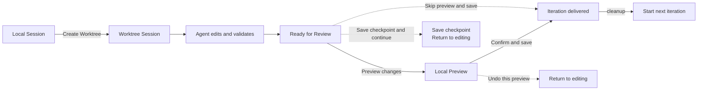
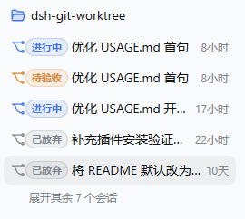

# dsh-git-worktree

[](https://www.npmjs.com/package/dsh-git-worktree)
[](https://www.npmjs.com/package/dsh-git-worktree)
[](https://github.com/wloops/dsh-git-worktree/actions/workflows/ci.yml)
[](LICENSE)

**Let agents work in real Git worktrees, preview changes in Local, and save only after explicit human confirmation.**

`dsh-git-worktree` is an experimental Session Target plugin for [DeepSeek Harness](https://github.com/deepseek-ai/DeepSeek-Harness). Each coding task receives an independent checkout, Workspace, and Session so agent construction state does not leak into the user-controlled Local checkout.

This is an independently maintained community plugin. It is not an official DeepSeek project and does not imply endorsement, partnership, or authorization.

[中文](README.md) · [Full usage guide](docs/USAGE.en.md) · [Architecture](docs/WORKTREE-CONSOLE-ARCHITECTURE.md)

## Why use it?

When an agent edits Local directly, task changes can mix with existing staged, unstaged, and untracked work. Multiple tasks may also compete for the same checkout. This plugin separates construction from delivery:

- the agent edits and tests only inside an isolated Worktree;
- the user first inspects a reversible Local Preview;
- the Host saves only the current task delta, excluding unrelated Local work;
- if safety cannot be proven, writes stop and recovery evidence is preserved.

## Highlights

- **Project-grouped sidebar**: each Managed owner appears under its original Local project with a Branch Icon and status Badge; ordinary Local Sessions keep the official behavior.
- **Real isolation**: every task gets its own Git Worktree, Workspace, and unique owner Session.
- **Human acceptance**: Ready lets the user choose **Preview changes**, **Confirm and save**, or another explicit action.
- **Reversible Preview**: changes reach Local without an immediate Commit and can be rolled back safely.
- **Task-only save**: final delivery creates one Commit for the accumulated task delta.
- **Save checkpoint and continue**: checkpoints remain inside the managed Worktree and still collapse into one final delivery.
- **Safe recovery**: handles Local drift, conflicts, `preview_detached`, restarts, and interrupted cleanup.
- **Parallel construction, serialized acceptance**: many Worktrees can run concurrently while each Local project accepts one Preview at a time.
- **Continuous iterations**: after delivery and cleanup, the same Session and conversation can begin another round.

> The scope is a **project-scoped Worktree Session delivery plugin**, not a cross-project global Worktree Manager.

## Workflow



### Which action should I choose?

| Goal | Action |
| --- | --- |
| Inspect the result in Local first | **Preview changes** |
| The Preview looks correct | **Confirm and save** |
| Preserve progress during a long task | **Save checkpoint and continue** |
| Ask the agent for more edits | **Continue editing** or **Undo this preview** |
| Deliver without a Preview | **Skip preview and save** |

See the [full usage guide](docs/USAGE.en.md) for detailed actions, recovery scenarios, and commands.

## Quick start

### Requirements

- Node.js `^22.19.0 || >=24.0.0`
- DeepSeek Harness `0.1.1-rc.2` package line
- Harness Web Client
- A Git Workspace

### Install

```bash
dsh plugin --profile web add dsh-git-worktree
```

Or install a specific version:

```bash
dsh plugin --profile web add github:wloops/dsh-git-worktree#v0.7.0
```

Open a Git Workspace and enable **Worktree** when creating a Session. An existing Local Session can also let the model call `worktree_create`.

For the first run, complete one full create → Preview changes → Confirm and save → cleanup cycle.

If pnpm build approval blocks a Git-source install, or you need complete commands and troubleshooting, see [Installation and troubleshooting](docs/USAGE.en.md#installation-and-troubleshooting).

## Screenshots

### Project grouping and task status



### Prepare the review


See the [full usage guide](docs/USAGE.en.md#complete-delivery-example) for the complete flow.

## Safety boundary

The Host rechecks every Local write at execution time. Browser caches and model output are never write authority. The plugin validates Session, checkout, revision, Git identity, Preview receipt, and Local state; branch switches, overlapping conflicts, unknown residue, or insufficient recovery evidence fail closed.

For the full state machine, CAS, and recovery invariants, see:

- [Worktree Console architecture](docs/WORKTREE-CONSOLE-ARCHITECTURE.md)
- [Session Target porting notes](docs/PORTING.md)

## Current boundaries

- A normal Managed owner is grouped under its original Local project. If the owner is missing, another Session exists, or membership conflicts, the original Workspace remains visible instead of hiding uncertain data.
- Managed owners can be renamed and archived. Worktree-aware Fork is not implemented yet, so the ordinary Fork action is hidden in this release.
- Child agents inherit the parent Session cwd; the plugin does not create per-child Worktrees.
- Checkpoint does not support editing, deleting, reordering, or arbitrary rollback of history.
- Domi's global Manager, Local Maintenance, dependency snapshots, and full collaborator lifecycle are outside this plugin's scope.

## Local development

```bash
pnpm install
pnpm run typecheck
pnpm test
pnpm run build
pnpm run check:publish
```

Run the local end-to-end environment:

```bash
pnpm run dev:dsh
```

See the [full usage guide](docs/USAGE.en.md#local-development) for more development commands and the [release checklist](docs/RELEASE.md) before publishing.

## Documentation

- [Full usage guide](docs/USAGE.en.md)
- [Worktree Console architecture](docs/WORKTREE-CONSOLE-ARCHITECTURE.md)
- [Session Target porting notes](docs/PORTING.md)
- [UI development notes](docs/UI-DEVELOPMENT.md)
- [Release checklist](docs/RELEASE.md)
- [Changelog](CHANGELOG.md)

## License

[MIT](LICENSE)
