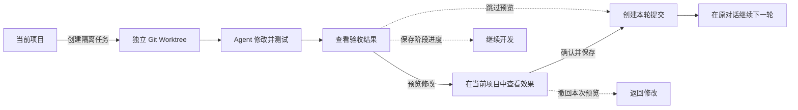

# dsh-git-worktree

[](https://www.npmjs.com/package/dsh-git-worktree)
[](https://www.npmjs.com/package/dsh-git-worktree)
[](https://github.com/wloops/dsh-git-worktree/actions/workflows/ci.yml)
[](LICENSE)

**让 Agent 在独立 Git Worktree 中完成任务，你看过修改后再决定是否保存。**

`dsh-git-worktree` 是 [DeepSeek Harness](https://github.com/deepseek-ai/DeepSeek-Harness) 的 Git Worktree 插件。它会为每个编码任务创建独立的 Worktree（工作目录），Agent 不会直接改动你正在使用的项目。任务完成后，你可以先预览结果，再选择保存、退回修改或放弃。

这套 Git Worktree 工作方式最初来自基于 Pi Agent Runtime 的开源桌面 coding 工作台 [Domi](https://github.com/restflux/domi)，本插件是针对 DeepSeek Harness 独立适配的版本，可以单独安装和使用。

[English](README.en.md) · [完整使用指南](docs/USAGE.md) · [架构说明](docs/WORKTREE-CONSOLE-ARCHITECTURE.md)

## 为什么使用它？

让 Agent 直接修改当前项目时，它的改动可能与你尚未提交的内容混在一起；同时运行多个任务时，也更容易互相影响。使用本插件后：

- 每个任务都在自己的 Git Worktree（独立工作目录）中修改和测试；
- 多个任务可以同时进行，不会共用同一个工作目录；
- Agent 完成后，你可以先把修改临时显示在当前项目中查看；
- 只有确认后才会保存本轮修改，遇到冲突时不会自动覆盖你的内容。

## 核心能力

- **Git Worktree 隔离**：每个任务都有独立的工作目录和 Agent 对话。
- **多个 Worktree 并行**：可以同时开发多个任务；为了避免混入修改，同一项目每次只验收一个任务。
- **提交前预览**：先在当前项目中查看真实效果，不会立即创建 Git 提交。
- **不满意可以退回**：撤回本次预览，继续让 Agent 修改，不影响其他本地改动。
- **只保存本轮任务**：确认后只提交这个任务的修改，不把无关内容一起带入。
- **长任务可分阶段**：先保存当前阶段的进度，再继续开发；最终仍合并为一次交付。
- **出错时保护现场**：检测到分支变化、内容冲突或中断时停止操作，保留现场供你处理。
- **集中查看任务**：同一项目的任务会聚合显示在侧边栏中，便于查看状态和切换。
- **原对话继续下一轮**：任务交付后，无需新开对话即可继续下一项修改。

> 当前版本管理单个项目中的 Git Worktree，暂不提供跨项目的全局管理界面。

## 工作流



### 怎么选？

| 目标 | 操作 |
| --- | --- |
| 先在当前项目中查看效果 | **预览修改** |
| 预览结果没有问题 | **确认并保存** |
| 任务很长，先固定当前进度 | **保存阶段并继续** |
| 还要让 Agent 改代码 | **继续修改**或**撤回本次预览** |
| 不需要先查看效果 | **跳过预览并保存** |

详细的操作、恢复场景和命令见[完整使用指南](docs/USAGE.md)。

## 快速开始

### 环境要求

- Node.js `^22.19.0 || >=24.0.0`
- DeepSeek Harness `0.1.2-rc.1` 包线
- Harness Web Client
- Git Workspace

从旧 Harness 升级时请先处理 Host 数据迁移：`0.1.2-rc.1` 已移除可选 SQLite Session 后端，旧数据需使用旧版 Harness 导出；Code Mode 已更名为 PTC mode，但现有会话记录仍可读取。应用和本插件统一通过 `dsh` Profile 启动与安装。

### 安装

```bash
dsh plugin --profile web add dsh-git-worktree
```

也可以安装指定版本：

```bash
dsh plugin --profile web add github:wloops/dsh-git-worktree#v0.7.2
```

安装后打开 Git Workspace，在新建 Session 时启用 **Worktree**；已有 Local Session 也可以让模型调用 `worktree_create` 创建隔离 Session。

第一次使用建议先完成一次“创建 → 预览修改 → 确认并保存 → cleanup”的完整流程。

如果 Git 源安装被 pnpm build approval 阻止，或需要查看完整命令和排错步骤，请阅读[安装与使用指南](docs/USAGE.md#安装与排错)。

## 界面预览

### 项目聚合与任务状态


### 准备验收


完整操作步骤见[完整使用指南](docs/USAGE.md#完整交付示例)。

## 安全边界

每次把任务修改写回当前项目之前，插件都会重新确认任务版本、项目位置和文件状态仍与验收时一致。如果你切换了分支、修改发生冲突，或上一次操作意外中断，插件会停止写入并保留现场，而不是猜测后继续覆盖。

Worktree 隔离主要用于避免任务之间误改文件，不是用来运行不受信任代码的系统沙箱。

更详细的状态检查与恢复规则见：

- [Worktree Console 架构](docs/WORKTREE-CONSOLE-ARCHITECTURE.md)
- [Session Target 迁移说明](docs/PORTING.md)

## 当前限制

- 只有归属关系明确的任务才会聚合到原项目；无法确认时仍保留原位置，避免任务被隐藏。
- 隔离任务可以重命名和归档，暂不支持从任务对话直接复制出新任务（Fork）。
- 子 Agent 与父任务使用同一个工作目录，不会再为每个子 Agent 创建新的 Worktree。
- 已保存的阶段记录暂不支持编辑、删除、调整顺序或回退到任意阶段。
- [Domi](https://github.com/restflux/domi) 中更完整的跨项目管理、直接修复当前项目、依赖复用和协作交接能力不在本插件当前范围内。

## 本地开发

```bash
pnpm install
pnpm run typecheck
pnpm test
pnpm run build
pnpm run check:publish
```

端到端启动：

```bash
pnpm run dev:dsh
```

更多开发命令见[完整使用指南](docs/USAGE.md#本地开发)，发布前检查见[发布清单](docs/RELEASE.md)。

## 文档

- [完整使用指南](docs/USAGE.md)
- [Worktree Console 架构](docs/WORKTREE-CONSOLE-ARCHITECTURE.md)
- [Session Target 迁移说明](docs/PORTING.md)
- [UI 开发说明](docs/UI-DEVELOPMENT.md)
- [发布清单](docs/RELEASE.md)
- [变更记录](CHANGELOG.md)

## 许可证

[MIT](LICENSE)
