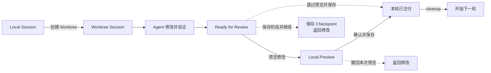

# dsh-git-worktree

[](https://www.npmjs.com/package/dsh-git-worktree)
[](https://www.npmjs.com/package/dsh-git-worktree)
[](https://github.com/wloops/dsh-git-worktree/actions/workflows/ci.yml)
[](LICENSE)

**让 Agent 在真实 Git Worktree 中执行任务，先预览修改，再由用户明确确认是否保存。**

`dsh-git-worktree` 是 [DeepSeek Harness](https://github.com/deepseek-ai/DeepSeek-Harness) 的实验性 Session Target 插件。每个编码任务使用独立 checkout、Workspace 和 Session，避免 Agent 施工状态直接混入用户控制的 Local checkout。

这是独立维护的社区插件，不是 DeepSeek 官方项目，也不代表官方背书、合作或授权。

[English](README.en.md) · [完整使用指南](docs/USAGE.md) · [架构说明](docs/WORKTREE-CONSOLE-ARCHITECTURE.md)

## 为什么使用它？

普通 Agent Session 直接修改 Local 时，任务增量容易与已有 staged、unstaged、untracked 内容混在一起；多个任务也可能争用同一个 checkout。该插件把“施工”和“交付”拆开：

- Agent 只在隔离 Worktree 中修改和测试；
- 用户先查看可撤回的 Local Preview；
- Host 只保存本轮任务增量，不吞入无关 Local 修改；
- 无法证明安全时停止写入并保留恢复证据。

## 核心能力

- **真实隔离**：每个任务拥有独立 Git Worktree、Workspace 和唯一 owner Session。
- **项目聚合侧边栏**：Managed owner 以 Branch Icon 和状态 Badge 直接归入原 Local 项目；普通 Local Session 保持官方行为。
- **人工验收**：Ready 后由用户选择“预览修改”“确认并保存”或其他操作。
- **可撤回 Preview**：预览写入 Local 但不立即创建 Commit，可安全撤回。
- **单任务保存**：最终只为本轮累计增量创建一个 Commit。
- **保存阶段并继续**：Checkpoint 只存在于 managed Worktree，最终仍合并为一次交付。
- **安全恢复**：处理 Local 漂移、冲突、`preview_detached`、重启和 cleanup 中断。
- **并行施工、串行验收**：多个 Worktree 可并行工作，同一 Local 项目一次只接受一个 Preview。
- **连续迭代**：交付并 cleanup 后，可在原 Session 和对话中开始下一轮。

> 当前定位是**项目级 Worktree Session 交付插件**，不是跨项目全局 Worktree Manager。

## 工作流



### 怎么选？

| 目标 | 操作 |
| --- | --- |
| 先在 Local 查看效果 | **预览修改** |
| Preview 没问题 | **确认并保存** |
| 任务很长，先固定进度 | **保存阶段并继续** |
| 还要让 Agent 改代码 | **继续修改**或**撤回本次预览** |
| 不需要 Preview | **跳过预览并保存** |

详细的操作、恢复场景和命令见[完整使用指南](docs/USAGE.md)。

## 快速开始

### 环境要求

- Node.js `^22.19.0 || >=24.0.0`
- DeepSeek Harness `0.1.1-rc.2` 包线
- Harness Web Client
- Git Workspace

### 安装

```bash
dsh plugin --profile web add dsh-git-worktree
```

也可以安装指定版本：

```bash
dsh plugin --profile web add github:wloops/dsh-git-worktree#v0.7.0
```

安装后打开 Git Workspace，在新建 Session 时启用 **Worktree**；已有 Local Session 也可以让模型调用 `worktree_create` 创建隔离 Session。

第一次使用建议先完成一次“创建 → 预览修改 → 确认并保存 → cleanup”的完整流程。

如果 Git 源安装被 pnpm build approval 阻止，或需要查看完整命令和排错步骤，请阅读[安装与使用指南](docs/USAGE.md#安装与排错)。

## 界面预览

### 项目聚合与任务状态


### 准备验收


完整操作步骤见[完整使用指南](docs/USAGE.md#完整交付示例)。

## 安全边界

所有 Local 写入都由 Host 在执行前重新检查，浏览器缓存和模型输出不构成写入授权。插件会验证 Session、checkout、revision、Git 身份、Preview receipt 和 Local 状态；遇到分支切换、重叠冲突、未知残余或恢复证据不足时会 fail closed。

完整状态机、CAS 和恢复不变量见：

- [Worktree Console 架构](docs/WORKTREE-CONSOLE-ARCHITECTURE.md)
- [Session Target 迁移说明](docs/PORTING.md)

## 当前边界

- 正常 Managed owner 会聚合到原 Local 项目；owner 缺失、额外 Session 或归属冲突时保留原 Workspace，避免静默隐藏数据。
- Managed owner 可以重命名和归档；Worktree-aware Fork 尚未实现，本版不显示普通 Fork 入口。
- 子 Agent 继承父 Session cwd，插件不额外创建 per-child Worktree。
- Checkpoint 不提供历史编辑、删除、重排或任意回退。
- Domi 的全局 Manager、Local Maintenance、依赖快照和完整 collaborator 生命周期不在本插件范围内。

## 本地开发

```bash
pnpm install
pnpm run typecheck
pnpm test
pnpm run build
pnpm run check:publish
```

端到端启动：

```bash
pnpm run dev:dsh
```

更多开发命令见[完整使用指南](docs/USAGE.md#本地开发)，发布前检查见[发布清单](docs/RELEASE.md)。

## 文档

- [完整使用指南](docs/USAGE.md)
- [Worktree Console 架构](docs/WORKTREE-CONSOLE-ARCHITECTURE.md)
- [Session Target 迁移说明](docs/PORTING.md)
- [UI 开发说明](docs/UI-DEVELOPMENT.md)
- [发布清单](docs/RELEASE.md)
- [变更记录](CHANGELOG.md)

## 许可证

[MIT](LICENSE)
