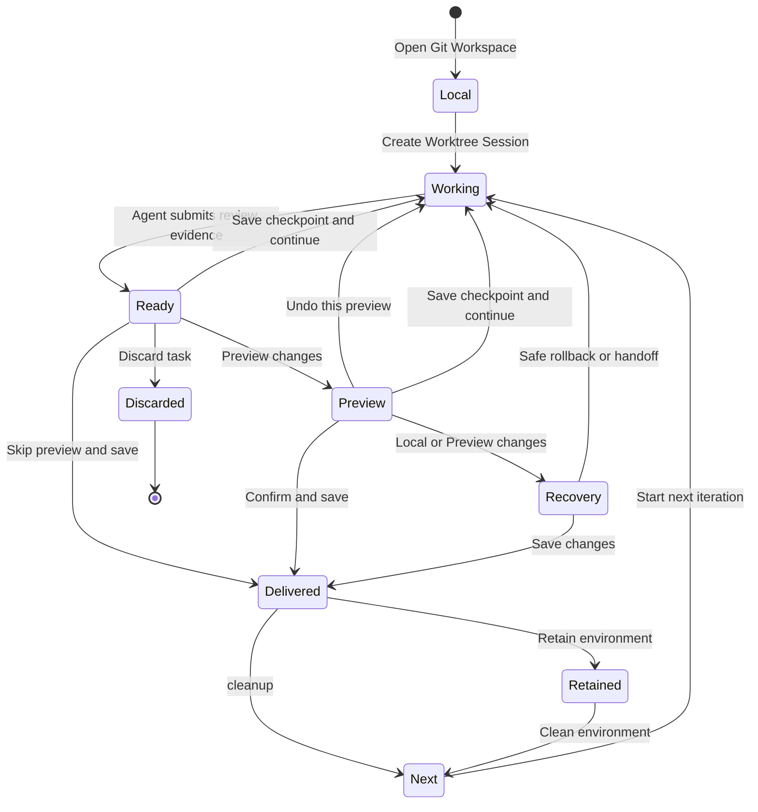

# dsh-git-worktree Usage Guide

This guide covers daily actions, recovery scenarios, commands, and troubleshooting. For the underlying state machine, CAS, and permission invariants, see [Worktree Console architecture](WORKTREE-CONSOLE-ARCHITECTURE.md).

[Back to README](../README.en.md) · [中文](USAGE.md)

## User flow



## Create a Worktree Session

### New Session

1. Open a Git Workspace.
2. Create a blank/new Session.
3. Enable **Worktree**.
4. Enter the task and confirm.

No Worktree is created before confirmation. The draft moves to a new isolated Session, and the Local Session is never silently switched to another cwd. After a successful handoff, the empty source launcher is archived so New Session cannot reuse it and block another concurrent task; the owner Worktree Session appears directly under the original Local project.

### Sidebar ownership

A Local project can still contain multiple ordinary Sessions. Each Managed Worktree has exactly one owner Session, so the sidebar shows that task Session and its delivery state directly instead of creating a UUID Workspace at the top level or an empty Worktree → Session nesting layer.

- A Managed row opens its unique owner Session directly and keeps the official rename and archive actions. Archiving only changes sidebar visibility; it does not discard the task or change Worktree state.
- Ordinary Fork is hidden in this release. A correct Worktree-aware Fork must create a new Managed Worktree and owner Session and is deferred to a later release.
- Dragging Managed rows and creating a New Session inside a Managed Workspace remain blocked so they cannot create a second Session or break ownership.
- A provably empty pre-session launcher is hidden from the sidebar projection; a real extra Session keeps the original Workspace visible for manual handling.
- After cleanup, historical tasks remain under the original project as Completed or Discarded using the plugin Registry.
- Unmanaged Workspaces and ordinary Sessions retain normal Workspace actions.

### Existing Local Session

The model can call `worktree_create` to create a new owner Session. Open the target Session from the returned card before asking the agent to edit code.

## Ready for Review

After implementation and validation, the agent calls `worktree_ready_for_review` with:

- a change summary;
- changed files;
- validation status and test commands;
- a suggested Commit Message.

Ready does not write to Local or create a Commit. The Review card automatically runs read-only Preflight.

### Ready actions

| Action | Result |
| --- | --- |
| **Preview changes** | Write the task delta to Local as an uncommitted, reversible Preview |
| **Save checkpoint and continue** | Create a checkpoint inside the managed Worktree without updating Local |
| **Continue editing** | Invalidate the old Review and return the current iteration to Working |
| **Skip preview and save** | Explicitly confirm direct delivery of the task delta |
| **Discard task** | Clean the Worktree after safety checks pass |

Ordinary discussion does not invalidate Ready. New code or file changes resume Working first.

## Local Preview

After **Preview changes**, the task delta is present in the Local working tree but no user Commit exists yet.

### Preview actions

| Action | Result |
| --- | --- |
| **Confirm and save** | Save only the task delta represented by the current Preview |
| **Undo this preview** | Remove the Preview and return to the Worktree |
| **Save checkpoint and continue** | Safely roll back Preview first, then save a checkpoint |
| **Discard task** | Attempt to close Preview safely and clean the Worktree |

Separable staged, unstaged, and untracked Local changes are preserved. If the task delta overlaps them, the operation stops instead of overwriting them.

## Checkpoint

Use **Save checkpoint and continue** for long tasks:

- the checkpoint Commit exists only in the managed Worktree;
- Local branch, index, and working tree are not involved;
- the Worktree returns to clean Working after save;
- later stages can produce another Ready;
- final Local delivery still produces one accumulated task Commit.

Checkpoint history is linear. Editing, deleting, reordering, and arbitrary rollback are not supported.

## Detached Preview recovery

If the Local branch/HEAD, index, or working tree changes after Preview, delivery may enter `preview_detached`. The UI first runs read-only Recovery Preflight and then shows only actions the Host can currently prove safe.

Possible actions include:

- **Retry rollback**: remove Preview while preserving separable later Local work;
- **Save changes**: apply the task delta to the currently verified Local HEAD and save it;
- **Let the agent analyze read-only**: inspect the evidence without changing the old Worktree or Local;
- **Hand off to a fresh Worktree**: create a new environment from the latest Local HEAD.

If safety cannot be proven, the plugin preserves the receipt, journal, and recovery evidence and does not retry writes automatically.

## Common states

| State | Meaning | Suggested action |
| --- | --- | --- |
| `stale_local` | Local changed after inspection | Refresh and rerun Preflight |
| `stale_isolated` | Worktree changed after Ready | Recheck or regenerate review evidence |
| conflict | Local and task delta overlap | Let the agent resolve the conflict in the original Worktree |
| `project_acceptance_busy` | Another task is previewing the same Local project | Open the blocker and wait for commit or rollback |
| `preview_detached` | Preview is separated from current Local state | Use the actions offered by Recovery Preflight |
| `recovery_required` | A write or cleanup result cannot be fully proven | Preserve evidence and follow the recovery guidance |
| `cleanup_pending` | Delivery completed but Worktree cleanup did not | Retry environment cleanup |
| `retained` | Delivery completed and the environment is retained | Change retention or clean manually |

## Model tools

| Tool | Purpose |
| --- | --- |
| `worktree_create` | Create a managed Worktree and independent target Session from Local |
| `worktree_list` | List related Worktrees visible to the current Session |
| `worktree_resume_revision` | Invalidate an old Review and resume the current iteration |
| `worktree_begin_next_iteration` | Recreate the Worktree cwd after delivery and cleanup |
| `worktree_ready_for_review` | Persist delivery evidence and wait for human acceptance |

Preview, Finalize, Discard, and Remove are not ordinary model tools. They are controlled by the user interface or Host commands.

## `/worktree` commands

```text
/worktree status
/worktree list
/worktree continue
/worktree next
/worktree finalize [<reviewId> <revision>] [cleanup|retain_24h|retain_3d|retain_manual]
/worktree finish <commit message>
/worktree discard
/worktree remove <checkoutId>
```

- `finalize` uses the suggested Commit Message from the current Review;
- `finish` uses a user-provided Commit Message;
- prefer the Web UI for daily use and commands for diagnostics or UI-less environments.

## Installation and troubleshooting

### npm install

```bash
dsh plugin --profile web add dsh-git-worktree
```

### Git tag install

```bash
dsh plugin --profile web add github:wloops/dsh-git-worktree#v0.7.4
```

If pnpm 10+ blocks `prepare` for a Git dependency, add this to the profile's `pnpm-workspace.yaml`:

```yaml
allowBuilds:
  dsh-git-worktree: true
```

Then reinstall the plugin.

### Plugin fails to load after a Harness upgrade

When the web UI shows **Failed to load plugins**, inspect the detailed error and installed version:

- `require("@deepseek-ai/dsh-client-runtime/client") missed the module table` means the plugin is still `0.7.2` or older, while Harness `0.1.2-rc.1` and later removed `dsh-client-runtime`.
- `dsh-git-worktree` waiting for `conversation` while the official Conversation/Sidebar plugins wait for `uiWorkspace` identifies the `0.7.3` Client activation cycle.

Install version `0.7.4` or later for either case and restart Harness:

```bash
dsh plugin --profile web add dsh-git-worktree@0.7.4
```

Confirm the installed version with `dsh plugin --profile web list` before restarting Harness. Note that pnpm's supply-chain policy delays freshly published releases: for a few days after publishing, `add` without a version may still resolve to an older build. To install immediately, add the exact version (for example `- dsh-git-worktree@0.7.4`) to the existing `minimumReleaseAgeExclude` list in the profile's `pnpm-workspace.yaml` and reinstall.

If you installed from a Git tag, install the latest tag with the Git tag command above instead. If the version is confirmed correct but the error persists, pnpm blocked the `prepare` build during the previous install. Add `allowBuilds` as shown above and reinstall.

### UI does not appear

Check:

1. the active profile is `web`;
2. the Workspace is a Git repository;
3. the plugin appears in `dsh plugin --profile web list`;
4. Harness was restarted after installation;
5. the browser bundle loaded the current plugin version.

### Worktree creation fails

Common causes include an inaccessible project root, Git failure, unknown content in the target directory, or Session/Workspace identity mismatch. The plugin never deletes a directory whose ownership it cannot prove.

### Preview changes is unavailable

Read the Preflight message first. The cause may be a conflict, stale Review, busy acceptance slot, Local branch change, or modified Worktree content. Refresh and follow the action offered by the UI.

## Complete delivery example

1. Create a Worktree Session:

   

2. The Managed owner is grouped under the original project and keeps its current task status visible:

   

3. The agent produces Ready for Review with **Preview changes** as the primary action:

   

4. Inspect the result in Local Preview. Choose **Confirm and save**, or use the More menu to **Withdraw this preview**.
5. On save, clean up immediately or retain the runtime environment when needed.
6. After cleanup, choose **Start next iteration** in the same owner Session.

> UI copy follows the installed version. This guide no longer embeds screenshots with the retired “Sync to Local review / Accept and commit” wording.

## Local development

Standard checks:

```bash
pnpm install
pnpm run typecheck
pnpm test
pnpm run build
pnpm run check:publish
```

Run the end-to-end environment:

```bash
pnpm run dev:dsh
```

Common variants:

```bash
pnpm run dev:dsh:install
pnpm run dev:dsh:smoke
pnpm run dev:dsh -- --repo G:/path/to/repo --port 4090 --profile web
pnpm run dev:dsh:remove
```

`dev:dsh` builds and installs only the current checkout. It does not publish npm packages or push Git refs.

## Further reading

- [README](../README.en.md)
- [Worktree Console architecture](WORKTREE-CONSOLE-ARCHITECTURE.md)
- [Session Target porting notes](PORTING.md)
- [UI development notes](UI-DEVELOPMENT.md)
- [Release checklist](RELEASE.md)
- [Changelog](../CHANGELOG.md)
