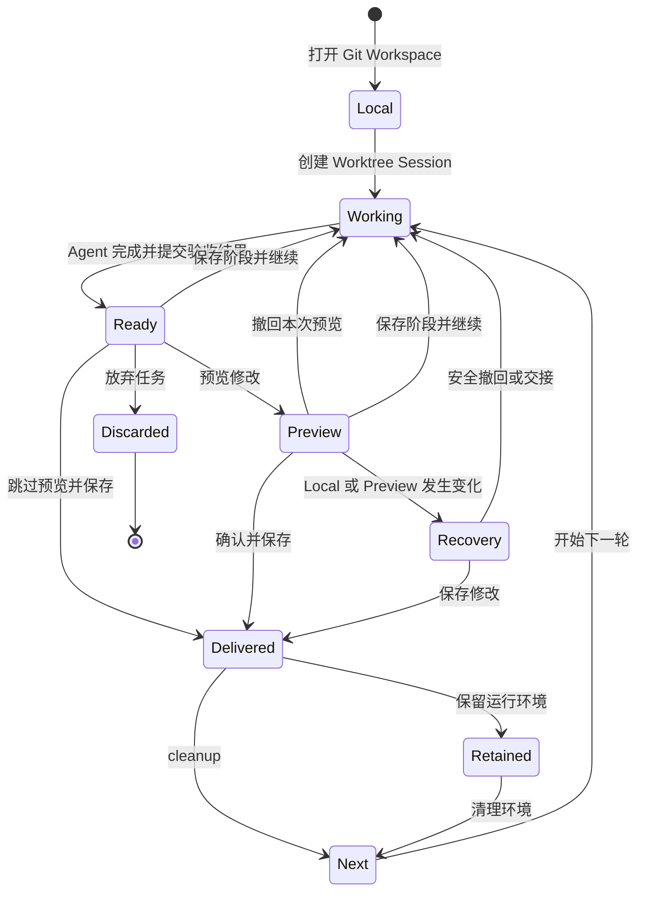

# dsh-git-worktree 使用指南

本指南说明日常操作、恢复场景、命令和常见问题。底层状态机、CAS 与权限不变量见 [Worktree Console 架构](WORKTREE-CONSOLE-ARCHITECTURE.md)。

[返回 README](../README.md) · [English](USAGE.en.md)

## 用户流程



## 创建 Worktree Session

### 新 Session

1. 打开 Git Workspace。
2. 创建 blank/new Session。
3. 启用 **Worktree**。
4. 输入任务并确认。

确认前不会创建 Worktree。确认后，草稿会迁移到新的隔离 Session，Local Session 不会被偷偷切换 cwd。迁移成功后，空白 source launcher 会自动归档，避免“新会话”复用它并阻塞下一项并发任务；owner Worktree Session 会直接显示在原 Local 项目下面。

### 侧边栏归属

Local 项目仍可包含多个普通会话。每个 Managed Worktree 只对应一个 owner Session，因此侧边栏直接显示任务会话和状态，不再把 UUID Worktree 作为独立顶级项目，也不会增加“Worktree → Session”的空层级。

- Managed 行可直接打开 owner Session，并保留官方重命名与归档；归档只影响侧边栏可见性，不会放弃任务或改变 Worktree 状态；
- 普通 Fork 在本版隐藏；正确的 Worktree-aware Fork 需要创建新的 Managed Worktree 与 owner Session，将在后续版本提供；
- Managed 行拖动和 Managed Workspace 的“新会话”入口会被阻止，避免产生第二个 Session 或破坏归属；
- 可证明为空的预会话 launcher 会从侧边栏投影中隐藏，真实额外 Session 则保留原 Workspace 以便人工处理；
- cleanup 后，历史任务仍按 Registry 归入原项目并显示“已完成”或“已放弃”；
- 非托管 Workspace 和普通会话继续使用标准 Workspace 操作。

### 已有 Local Session

模型可以调用 `worktree_create` 创建新的 owner Session。返回卡片后打开目标 Session，再让 Agent 修改代码。

## Ready for Review

Agent 完成实现和验证后调用 `worktree_ready_for_review`，保存：

- 变更摘要；
- changed files；
- 验证状态和测试命令；
- 建议 Commit Message。

Ready 不写入 Local，也不创建 Commit。Review 卡会自动执行只读 Preflight。

### Ready 操作

| 操作 | 结果 |
| --- | --- |
| **预览修改** | 把任务增量写入 Local，保持未提交且可撤回 |
| **保存阶段并继续** | 在 managed Worktree 内创建 Checkpoint，Local 不更新 |
| **继续修改** | 使旧 Review 失效并返回当前 iteration 的 Working |
| **跳过预览并保存** | 经确认后直接保存本轮增量 |
| **放弃任务** | 在安全检查通过后清理 Worktree |

普通讨论不会使 Ready 失效；新的代码或文件修改会先恢复 Working。

## Local Preview

点击 **预览修改** 后，本轮任务增量会进入 Local working tree，但尚未创建用户 Commit。

### Preview 操作

| 操作 | 结果 |
| --- | --- |
| **确认并保存** | 只保存当前 Preview 对应的任务增量 |
| **撤回本次预览** | 移除 Preview，返回 Worktree 继续修改 |
| **保存阶段并继续** | 先安全撤回 Preview，再保存 Checkpoint |
| **放弃任务** | 尝试安全收口 Preview 并清理 Worktree |

Local 中与任务可分离的 staged、unstaged、untracked 修改会保留。若任务增量与这些修改重叠，操作会停止而不是覆盖。

## Checkpoint

**保存阶段并继续**适合长任务：

- 阶段 Commit 只存在于 managed Worktree；
- Local branch、index 和 working tree 不参与；
- 保存后 Worktree 回到 clean Working；
- 后续可以继续生成新的 Ready；
- 最终 Local 仍只得到一个累计任务 Commit。

当前仅支持线性阶段摘要，不支持编辑、删除、重排或任意回退历史 Checkpoint。

## Detached Preview 恢复

如果 Preview 后 Local branch/HEAD、index 或 working tree 继续变化，交付可能进入 `preview_detached`。界面会先执行只读 Recovery Preflight，再显示当前可证明安全的操作。

可能出现：

- **重新尝试撤回**：移除 Preview，同时保留后续可分离的 Local 修改；
- **保存修改**：把任务增量应用到当前可验证的 Local HEAD 并保存；
- **让 Agent 只读分析**：分析现场，不修改旧 Worktree 或 Local；
- **交接到新 Worktree**：从最新 Local HEAD 创建新环境继续恢复。

无法证明安全时，插件保留 receipt、journal 和恢复证据，不自动重试写入。

## 常见状态

| 状态 | 含义 | 建议操作 |
| --- | --- | --- |
| `stale_local` | Local 在检查后变化 | 刷新并重新 Preflight |
| `stale_isolated` | Worktree 在 Ready 后变化 | 重新检查或重新生成验收结果 |
| conflict | Local 与任务增量重叠 | 让 Agent 在原 Worktree 中解决冲突 |
| `project_acceptance_busy` | 其他任务正在预览同一 Local 项目 | 查看占用任务，等待其提交或撤回 |
| `preview_detached` | Preview 与当前 Local 状态分离 | 使用 Recovery Preflight 提供的操作 |
| `recovery_required` | 写入或清理结果无法完整证明 | 保留现场，按界面提示恢复 |
| `cleanup_pending` | 已交付，但 Worktree 清理未完成 | 重试清理环境 |
| `retained` | 已交付并保留运行环境 | 调整保留期限或手动清理 |

## 模型工具

| 工具 | 作用 |
| --- | --- |
| `worktree_create` | 从 Local Session 创建 managed Worktree 和独立 target Session |
| `worktree_list` | 列出当前 Session 可见的关联 Worktrees |
| `worktree_resume_revision` | 使旧 Review 失效并恢复当前 iteration |
| `worktree_begin_next_iteration` | 为已交付且 cleanup 完成的 Session 重建 Worktree cwd |
| `worktree_ready_for_review` | 保存交付报告并等待用户验收 |

Preview、Finalize、Discard 和 Remove 不属于普通模型工具，由用户界面或 Host 命令控制。

## `/worktree` 命令

```text
/worktree status
/worktree list
/worktree continue
/worktree next
/worktree finalize [<reviewId> <revision>] [cleanup|retain_24h|retain_3d|retain_manual]
/worktree finish <commit message>
/worktree discard
/worktree remove <checkoutId>
```

- `finalize` 使用当前 Review 的建议 Commit Message；
- `finish` 使用用户提供的 Commit Message；
- 日常操作优先使用 Web UI，命令适合诊断或无 UI 场景。

## 安装与排错

### npm 安装

```bash
dsh plugin --profile web add dsh-git-worktree
```

### Git tag 安装

```bash
dsh plugin --profile web add github:wloops/dsh-git-worktree#v0.7.4
```

pnpm 10+ 如果阻止 Git dependency 执行 `prepare`，在 profile 的 `pnpm-workspace.yaml` 中加入：

```yaml
allowBuilds:
  dsh-git-worktree: true
```

然后重新安装插件。

### 升级 Harness 后插件加载失败

Web 界面显示 **Failed to load plugins** 时，先检查错误详情和已安装版本：

- 报错包含 `require("@deepseek-ai/dsh-client-runtime/client") missed the module table`：当前仍是 `0.7.2` 或更早版本，而 Harness `0.1.2-rc.1` 起已移除 `dsh-client-runtime`。
- 报错显示 `dsh-git-worktree` 等待 `conversation`，同时官方 Conversation/Sidebar 等待 `uiWorkspace`：当前是 `0.7.3` 的 Client 启动循环依赖。

两种情况都应安装 `0.7.4` 或更高版本并重启 Harness：

```bash
dsh plugin --profile web add dsh-git-worktree@0.7.4
```

重装后先 `dsh plugin --profile web list` 确认版本，再重启 Harness。注意 pnpm 的供应链策略会推迟安装刚发布的版本：新版本发布后几天内，不带版本号的 `add` 可能仍解析到旧版。需要立即安装时，把精确版本加入 profile `pnpm-workspace.yaml` 已有的 `minimumReleaseAgeExclude` 列表（如 `- dsh-git-worktree@0.7.4`）后重新安装。

从 Git tag 安装的用户改用上方 Git tag 命令安装最新 tag 即可。如果版本确认无误仍报同样错误，说明上次安装时 `prepare` 构建被 pnpm 拦截，按上文加入 `allowBuilds` 后重新安装。

### 界面未出现

检查：

1. 当前 profile 是否为 `web`；
2. Workspace 是否为 Git 仓库；
3. 插件是否出现在 `dsh plugin --profile web list`；
4. 安装后是否重启 Harness；
5. 浏览器 bundle 是否加载当前插件版本。

### Worktree 无法创建

常见原因包括项目根不可访问、Git 命令失败、目标目录存在未知内容，或 Session/Workspace 身份不匹配。插件不会自动删除无法确认归属的目录。

### 无法预览修改

先查看 Preflight 提示：可能是冲突、Review 已过期、验收槽位占用、Local 分支变化或 Worktree 内容已变化。刷新状态后按界面提供的下一步处理。

## 完整交付示例

1. 创建 Worktree Session：

   

2. Managed owner 聚合到原项目，并持续显示当前任务状态：

   

3. Agent 完成后生成 Ready for Review，主操作为“预览修改”：

   

4. Local Preview 中确认实际效果；可以“确认并保存”，也可以从更多菜单“撤回本次预览”。
5. 保存时选择立即 cleanup，或按需保留运行环境。
6. cleanup 完成后，可在同一 owner Session 中“开始下一轮修改”。

> 界面文案以当前安装版本为准。本指南不再展示旧版“同步到 Local 验收 / 验收通过并提交”截图。

## 本地开发

标准检查：

```bash
pnpm install
pnpm run typecheck
pnpm test
pnpm run build
pnpm run check:publish
```

端到端运行：

```bash
pnpm run dev:dsh
```

常用变体：

```bash
pnpm run dev:dsh:install
pnpm run dev:dsh:smoke
pnpm run dev:dsh -- --repo G:/path/to/repo --port 4090 --profile web
pnpm run dev:dsh:remove
```

`dev:dsh` 只构建和安装当前 checkout，不会发布 npm 包或 push Git refs。

## 进一步阅读

- [README](../README.md)
- [Worktree Console 架构](WORKTREE-CONSOLE-ARCHITECTURE.md)
- [Session Target 迁移说明](PORTING.md)
- [UI 开发说明](UI-DEVELOPMENT.md)
- [发布清单](RELEASE.md)
- [变更记录](../CHANGELOG.md)
